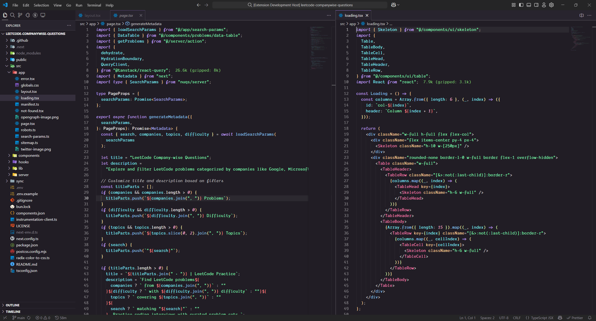
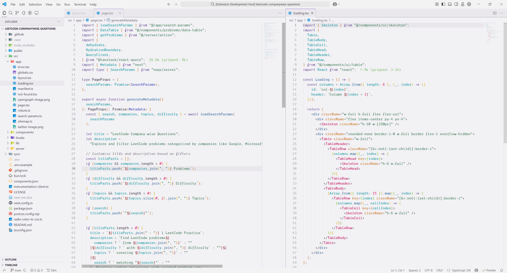

  

<h1 align="center">
  Kiro Theme for VS Code
</h1>

  A beautiful and modern VS Code theme with vibrant purple colors and excellent readability, forked from Kiro IDE.

## Installation via VS Code

1. Open **Extensions** sidebar panel in VS Code. `View → Extensions`
2. Search for `Kiro Theme` by MohdZaid
3. Click **Install** to install it
4. Click **Reload** to reload the editor
5. Go to **File > Preferences > Color Theme** and select:
   - **Kiro Dark** for dark theme
   - **Kiro Light** for light theme

## Manual Installation

Read the [VSC Extension Quickstart Guide](https://github.com/BioHazard786/kiro-theme-vscode/blob/main/vsc-extension-quickstart.md)

## Features

- 🎨 **Beautiful Purple Color Scheme**: Carefully crafted purple-based colors
- 🌙 **Dark & Light Variants**: Both dark and light themes available
- 👁️ **Excellent Readability**: High contrast for better code visibility
- 🔧 **Modern UI**: Clean and modern interface design
- 📝 **Comprehensive Syntax Highlighting**: Support for multiple programming languages

## Color Reference

### Dark Theme Syntax Colors

|                               Color                                | Usage                                           |
| :----------------------------------------------------------------: | ----------------------------------------------- |
|  `#e2d3fe` | Keywords, storage types                         |
|  `#8dc8fb` | Functions, methods, entity names                |
|  `#ffcf99` | Classes, modules, attributes                    |
|  `#80ffb5` | Strings, selectors                              |
|  `#80f4ff` | Variables, objects, properties                  |
|  `#ff80b5` | Classes, symbols, constants                     |
|  `#ffffff99` | Comments                                        |

### Light Theme Syntax Colors

|                               Color                                | Usage                                           |
| :----------------------------------------------------------------: | ----------------------------------------------- |
|  `#876eb1` | Keywords, storage types                         |
|  `#2d6a9f` | Functions, methods, entity names                |
|  `#d08025` | Classes, modules, attributes                    |
|  `#367c53` | Strings, selectors                              |
|  `#0c9aa7` | Variables, objects, properties                  |
|  `#c80e5c` | Classes, symbols, constants                     |
|  `#352f3d99` | Comments                                        |

### UI Colors (Dark Theme)

|                               Color                                | Usage                                      |
| :----------------------------------------------------------------: | ------------------------------------------ |
|  `#19161d` | Workbench background                       |
|  `#211d25` | Editor background                          |
|  `#28242e` | Sidebar, panels, input backgrounds         |
|  `#b080ff` | Primary accent color                       |
|  `#7138cc` | Buttons, badges, progress bars             |
|  `#ffffff` | Primary text color                         |
|  `#938f9b` | Secondary text, status bar                 |
|  `#80ffb5` | Git additions, success states             |
|  `#ff8080` | Errors, git deletions                     |
|  `#ffcf99` | Warnings, git modifications               |

### UI Colors (Light Theme)

|                               Color                                | Usage                                      |
| :----------------------------------------------------------------: | ------------------------------------------ |
|  `#dcdadf` | Workbench background                       |
|  `#f2f1f4` | Editor background                          |
|  `#eae8ed` | Sidebar, panels, input backgrounds         |
|  `#7138cc` | Primary accent color                       |
|  `#8e47ff` | Buttons, badges, progress bars             |
|  `#352f3d` | Primary text color                         |
|  `#938f9b` | Secondary text, status bar                 |
|  `#367c53` | Git additions, success states             |
|  `#993333` | Errors, git deletions                     |
|  `#d08025` | Warnings, git modifications               |

## Contributing

Found a bug or want to suggest an improvement? Please open an issue or submit a pull request on [GitHub](https://github.com/BioHazard786/kiro-theme-vscode).

## Screenshots

### Dark Theme

### Light Theme

## Theming Reference

- [VS Code Theme Color Reference](https://code.visualstudio.com/docs/getstarted/theme-color-reference)
- [VS Code Theme Documentation](https://code.visualstudio.com/docs/extensions/themes-snippets-colorizers)
- [VS Code Publishing Extensions](https://code.visualstudio.com/docs/extensions/publish-extension)

## License

MIT License - see the [LICENSE](LICENSE) file for details.

## Changelog

See [CHANGELOG.md](CHANGELOG.md) for release notes.

---

**Enjoy coding with Kiro Theme!** 🎨
